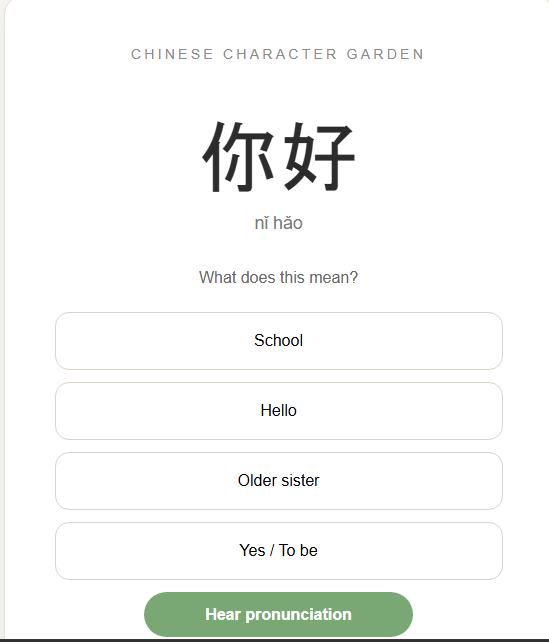

# Chinese Character Garden

An interactive Chinese vocabulary quiz game built with HTML, CSS, and JavaScript. Players test their knowledge of beginner Chinese vocabulary while tracking their progress through different garden growth stages.

## Features

- 50 beginner Chinese vocabulary words
- Chinese pronunciation using the Web Speech API
- Multiple-choice quiz
- Progress bar
- Garden growth stages
- Completion timer
- Restart game
- Responsive design for mobile devices

## Built With

- HTML5
- CSS3
- JavaScript

## Installation

1. Clone or download this repository.
2. Open `index.html` in your web browser.

## Screenshot

## Screenshot

## Future Improvements

- Score leaderboard
- Difficulty levels
- Additional vocabulary packs
- Dark mode
- Save progress using Local Storage

## Author

Aisha Abimbola Hassan-Giwa